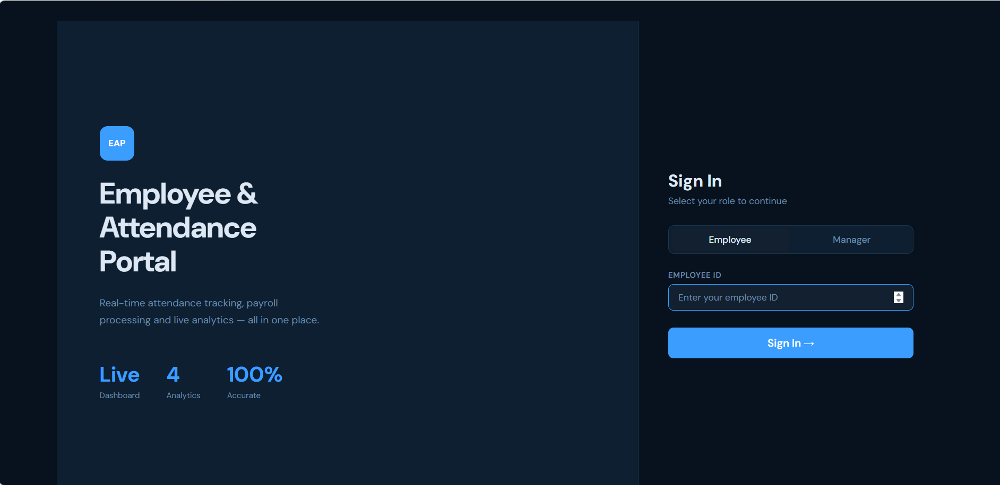
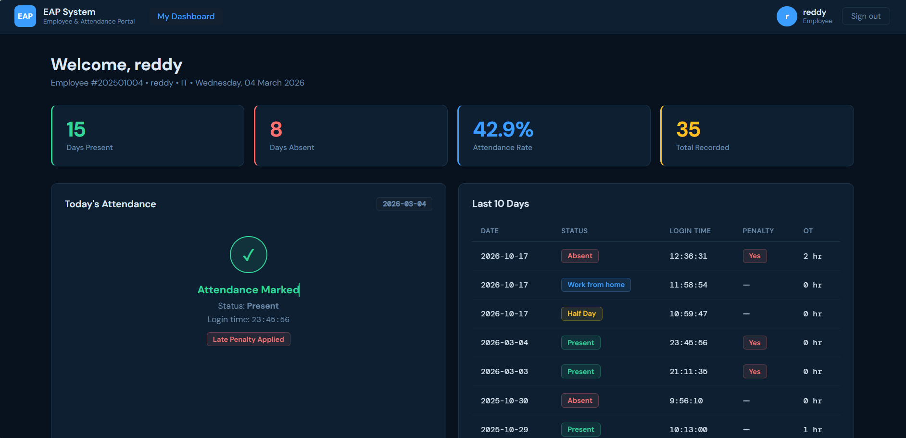
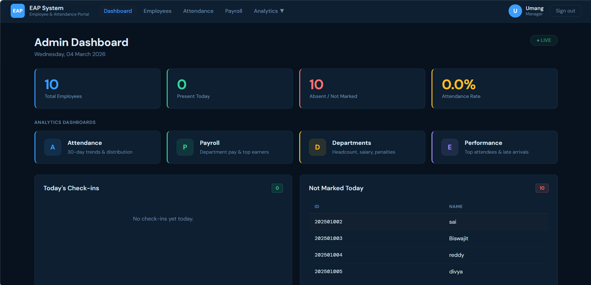
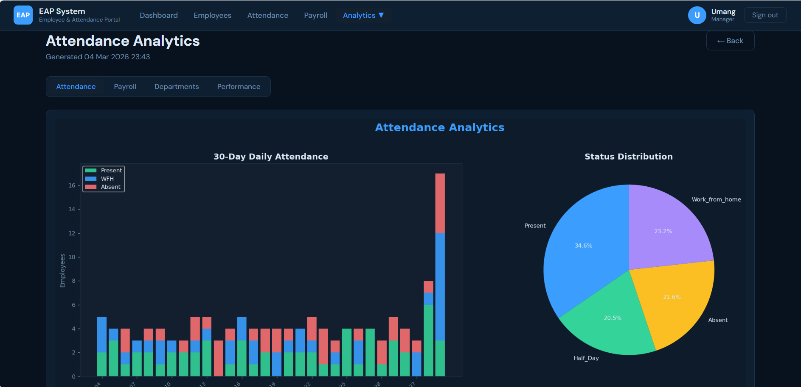
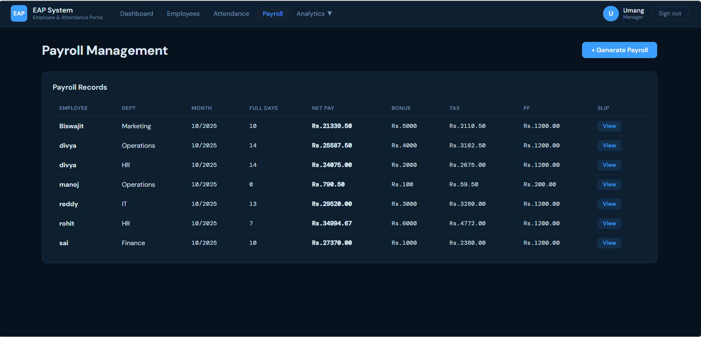

# 📊 Employee Attendance & Payroll Management System

A **Flask-based Employee Attendance & Payroll Management System** that helps organizations manage employee records, track attendance, generate payroll, and analyze workforce performance through **data analytics dashboards**.

This project combines **web development and data analytics** to transform raw attendance data into actionable insights for managers.

---

# 🚀 Features

### 👤 Employee Module
- Employee login using **Employee ID**
- Mark attendance (Present / Half Day / Work From Home / Absent)
- Automatic **late penalty detection**
- View attendance history
- Track attendance statistics

### 🧑‍💼 Manager Module
- Manager login with **secure PIN**
- Add, update, and delete employees
- Monitor daily attendance
- Identify employees who **have not marked attendance**
- Generate **automated payroll**
- View and download **payment slips**

### 📊 Data Analytics
- Attendance trend analysis
- Department-wise workforce insights
- Employee performance analytics
- Payroll distribution visualization

---

# 📸 Project Screenshots

## 🔐 Login Page


---

## 👤 Employee Dashboard


---

## 🧑‍💼 Admin Dashboard


---

## 📊 Attendance Analytics


---

## 💰 Payroll Management


---

# 🛠 Tech Stack

| Technology | Purpose |
|------------|---------|
| Python | Backend logic |
| Flask | Web framework |
| MySQL | Database |
| HTML / CSS / Jinja2 | Frontend templates |
| Matplotlib | Data visualization |
| JavaScript | Dynamic components |

---

# 🗄 Database Tables

The system uses the following MySQL tables:

- **employees** – Stores employee details  
- **attendance** – Daily attendance records  
- **departments** – Department information  
- **manager** – Manager authentication  
- **payroll** – Payroll calculations  

---

# ⚙ Installation

### 1️⃣ Clone Repository

```bash
git clone https://github.com/yourusername/employee-attendance-payroll-system.git
cd employee-attendance-payroll-system
